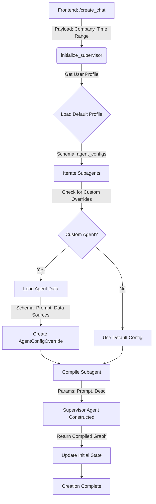

# Building Custom Agents in LangGraph Using a Supervisor Agent

This guide demonstrates how to build custom agents in the context of a chat interface using LangGraph's supervisor agent pattern.

## Table of Contents

- [Scenario 1: Initiate a New Chat Interface](#scenario-1-initiate-a-new-chat-interface)
- [Scenario 2: Streaming](#scenario-2-streaming)
- [Scenario 3](#scenario-3)
- [Scenario 4: Uploading Data](#scenario-4-uploading-data)

---

## Scenario 1: Initiate a New Chat Interface

When initiating a new chat interface, the frontend makes a `/create_chat` FastAPI call. This endpoint receives a payload that can include various useful information for initializing the supervisor agent. 

For example, the frontend may send:
- `company_name`: The company context for the chat session
- `time_range`: A time period relevant to the conversation

The payload structure is flexible and can contain any data useful for configuring and initializing the supervisor agent appropriately for the specific use case.

### Initialization Workflow



### Getting Thread ID and User ID

Within the new chat interface initialization, we must first obtain two critical identifiers:

**Thread ID**: A random UUID that uniquely identifies the conversation thread. This serves dual purposes:
- Debugging and tracking conversations
- Enabling custom inputs and configurations (more details provided later)

**User ID**: Retrieved from the incoming request using FastAPI middleware to parse the JWT token. This ensures secure user authentication and allows for user-specific agent configurations. Additional implementation details will be covered later.

### Initializing the Supervisor Agent

Once we have the `user_id` and `thread_id`, we initialize a supervisor agent with these parameters. The initialization process returns two key components:
- **compiledGraph**: The compiled LangGraph workflow for the supervisor agent
- **default profile**: A schema defining the chat profile configuration

### Default Profile Schema

The default profile is the schema for creating a chat profile, which defines what agents to use for a session. Each agent can be either a system agent or a custom agent. The schema includes:

- **chat_profile_name**: The name of the chat profile
- **welcome_message**: A greeting message for the chat session
- **agent_configs**: A dictionary with the structure:
  ```python
  {
    "agent_name": {
      "enabled": true,
      "custom_agent": "UUID"  # Optional, only for custom agents
    }
  }
  ```

### Agent Override Logic in `initialize_supervisor`

Within the `initialize_supervisor` function, the following process occurs:

1. **Get Existing Profile**: First, we retrieve the existing profile from storage. We use the User_ID and SQLAlchemy to get this profile.

2. **Process Agent Configurations**: If there is an existing default profile with all agents in the `agent_configs` attribute, we iterate through each agent:

   ```python
   for agent_type, config in chat_profile.agent_configs.items():
       custom_agent_id = config.get("custom_agent_id")
   ```

3. **Identify Custom Agents**: For each agent, we check if the `agent_configs` dictionary has a `custom_agent_id` attribute. If present, we know it's a custom agent. 

4. **Retrieve Agent Attributes**: When a custom agent is identified, we use the `agent_id` to fetch all relevant attributes about that agent:
   - **Model/instance**: The LLM model configuration for the agent
   - **Agent prompt**: The system prompt specific to this agent
   - **Agent data sources**: A list containing data source configurations, where each entry includes:
     - `connection_id`: Unique identifier for the data source connection
     - `id`: Type identifier for the data source (e.g., "tavily", "sharepoint", etc.)

5. **Build Agent Override Dictionary**: For each custom agent found, we add entries to an `agent_override` dictionary. This dictionary contains:
   - **Agent name**: The key identifying the agent
   - **Override properties**:
     - `description`: Used for the supervisor prompt to understand the agent's role
     - `system_prompt`: Used for the agent-level prompt to define its behavior
     - `data_sources`: The configured data sources for the agent

This override mechanism allows the supervisor agent to dynamically adapt to custom agent configurations while maintaining a consistent interface.

### Creating the FastStream Supervisor

After building the override dictionary, we call the `create_faststream_supervisor` function. This function constructs the supervisor agent which orchestrates multiple subagents.

**Function Parameters:**
- `model`: The ChatModel instance
- `broker`: The message broker for communication
- `langfuse_callback`: Callback for tracing and monitoring
- `checkpointer`: For state persistence
- `agents`: A list of default `SUB_AGENTS` (FastStreamAgent classes)
- `thread_id`: The conversation thread identifier
- `user_id`: The user identifier
- `agent_configs`: The `agent_override` dictionary created in the previous step

**Agents List Structure**:
The `agents` parameter passed to `create_faststream_supervisor` is a list of `FastStreamAgent` classes. Each class is defined with specific attributes that configure its behavior within the distributed system:
- **Broker Configuration**: Details on where to send messages and which queues to listen to.
- **Name**: The unique identifier for the agent.
- **Compile Function**: A method responsible for setting up the agent's internal state graph and handling the injection of runtime overrides.

**Subagent Compilation and Overrides:**

Inside `create_faststream_supervisor`, the system iterates through each subagent in the `agents` list. For each subagent:

1. **Check for Overrides**: The system checks if an override exists for the current agent in the `agent_configs` dictionary.

2. **Prepare Configuration**: If an override exists, an `AgentConfigOverride` schema is created containing:
   - `description`
   - `system_prompt`
   - `data_sources`

3. **Compile Subagent**: The agent's `compile` method is called with:
   - `broker`
   - `thread_id`
   - `user_id`
   - `agent_config` (the override schema)

   This `compile` method returns a `compiledGraph`.

**Subagent Architecture**:
Each subagent is a `StateGraph` containing a single node (function) called `faststream_agent`. The graph starts and ends with this node.

**Runtime Execution Flow**:
When the supervisor routes a request to a subagent:
1. The `faststream_agent` function is executed.
2. It constructs a payload containing:
   - The `agent_config` (with all custom overrides).
   - The **current state** from the supervisor.
3. The function publishes this payload to the message broker using `broker.publish(...payload, self.queue_name)`.
4. This sends the task—along with the specific custom configuration (prompts, data sources) and current conversation state—to the container where the subagent logic is actually executed.
5. The subagent processes the request and returns the **updated state**, which is then synchronized back to the supervisor.

This architecture ensures that even though the supervisor is centralized, each subagent execution carries its specific, dynamically generated configuration at runtime.

### Finalizing the Creation Route

Once all subagents are compiled, the `create_faststream_supervisor` function returns the fully constructed supervisor agent. This compiled graph is then used to initialize the state.

At this point, the creation route is complete. The system has:
1. Validated the user and thread.
2. Retrieved the chat profile and overrides.
3. Compiled the supervisor and its subagents with dynamic configurations.
4. Updated the initial state.

---

## Scenario 2: Streaming

This scenario covers how the system handles real-time streaming of responses from the supervisor and its subagents.

*(Details to be added)*

---

## Scenario 3: (Placeholder)

*(Details to be added)*

---

## Scenario 4: Uploading Data

This scenario will explain how to handle data uploads within the chat interface and how agents interact with this data.

*(Details to be added)*
