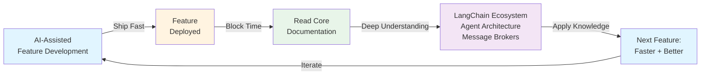

# LinkedIn Post: Balancing AI Speed with Deep Learning

---

🚨 **I can ship features in hours with AI. But I realized I'm building faster than I'm learning.**

At work, we move fast. AI helps us ship quickly. But I was skipping the fundamentals.

**The fix:**
After each feature, I block time to read the docs for what I just used.

- LangChain → Read LangGraph agent architecture
- Message brokers → Study the patterns
- RAG → Learn retrieval strategies

**The result:**
Each feature becomes a learning opportunity. The next one is faster *and* better because I understand the tools deeper.

Speed is valuable. But knowledge compounds. Pair AI development with intentional learning. You get rapid delivery today and deeper expertise tomorrow.

How do you balance speed with learning?

*Views are my own*

#AI #SoftwareDevelopment #LangChain #AgentArchitecture #MessageBrokers #ContinuousLearning #TechLeadership #DeveloperProductivity #AICopilot #EngineeringExcellence

---

