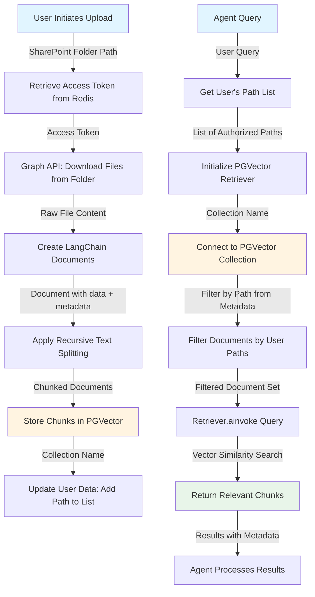

# Using SharePoint Within Agents

This guide explains how SharePoint integration works within the agent system, covering both uploading data from SharePoint and retrieving it for agent queries.

## Table of Contents

- [Uploading Data from SharePoint](#uploading-data-from-sharepoint)
- [Retrieving Data from SharePoint](#retrieving-data-from-sharepoint)
- [Complete Workflow](#complete-workflow)

---

## Uploading Data from SharePoint

The upload process begins by connecting to SharePoint using the Microsoft Graph API. Authentication is handled through an access token that is stored in a Redis cache for efficient retrieval and reuse.

### Authentication Flow

1. **Access Token Retrieval**: The system retrieves the access token from Redis cache. This token is used to authenticate all Graph API requests.

2. **File Download**: Using the Graph API with the cached access token, the system downloads files from a specified SharePoint folder. Each file is processed individually.

3. **Document Creation**: Downloaded files are converted into LangChain documents. Each document contains:
   - **data**: The actual content of the file
   - **metadata**: A dictionary containing file information, including the **path** which is crucial for later filtering

4. **Text Chunking**: The document content is processed using recursive text splitting to break it into manageable chunks. This ensures that large documents can be efficiently stored and retrieved.

5. **Vector Storage**: The chunked documents are stored in PGVector, a PostgreSQL extension that enables vector similarity search. Each chunk is embedded and stored with its associated metadata.

### Key Components

- **Graph API**: Microsoft's RESTful API for accessing SharePoint resources
- **Redis Cache**: Stores access tokens for efficient authentication
- **LangChain Documents**: Standardized document format with content and metadata
- **Recursive Text Splitting**: Chunking strategy for breaking down large documents
- **PGVector**: Vector database for storing and searching document embeddings

---

## Retrieving Data from SharePoint

When an agent needs to retrieve information from SharePoint, it uses a specialized retriever tool that connects to the PGVector database.

### Retriever Tool Architecture

1. **Collection Connection**: The retriever tool connects to a specific collection in PGVector using a collection name. This allows for data isolation and organization.

2. **Path-Based Filtering**: The retriever tool filters documents by path name, which is stored in the document metadata. This ensures that only relevant documents from the user's specific SharePoint folders are searched.

3. **User Data Association**: Each user has their own data configuration that contains a list of all SharePoint paths they have access to. The retriever uses this list to filter documents before performing searches.

4. **Filtered Search**: When `retriever.ainvoke()` is called, it first applies path-based filtering, then searches only through the filtered subset of documents. This dramatically improves search efficiency and ensures users only see results from their authorized SharePoint locations.

### Retrieval Process

```python
# Simplified retrieval flow
retriever = PGVector.get_retriever(collection_name="user_collection")
filtered_retriever = retriever.filter_by_path(user_paths)
results = await filtered_retriever.ainvoke(query)
```

### Key Features

- **Collection Isolation**: Each collection in PGVector represents a specific data source or user context
- **Metadata Filtering**: Path information in metadata enables precise document filtering
- **User-Specific Access**: Users can only retrieve data from paths they have uploaded or have been granted access to
- **Efficient Search**: Pre-filtering reduces the search space, improving both speed and relevance

---

## Complete Workflow

The following flowchart illustrates the complete process from uploading SharePoint files to retrieving them through agent queries:



### Workflow Steps

**Upload Phase:**
1. User provides SharePoint folder path
2. System retrieves access token from Redis cache
3. Graph API downloads all files from the specified folder
4. Files are converted to LangChain documents with metadata (including path)
5. Documents are chunked using recursive text splitting
6. Chunks are embedded and stored in PGVector
7. User's path list is updated to include the new SharePoint paths

**Retrieval Phase:**
1. Agent receives a user query
2. System retrieves the user's list of authorized SharePoint paths
3. PGVector retriever is initialized with the collection name
4. Retriever filters documents by matching paths in metadata against user's path list
5. Filtered retriever performs vector similarity search on the reduced document set
6. Relevant chunks are returned to the agent
7. Agent processes and incorporates results into its response

### Benefits of This Architecture

- **Security**: Path-based filtering ensures users only access their own data
- **Efficiency**: Pre-filtering reduces search space and improves query performance
- **Scalability**: PGVector handles large document collections efficiently
- **Flexibility**: Users can connect multiple SharePoint folders to their agent
- **Isolation**: Collection-based storage allows for clean data separation

