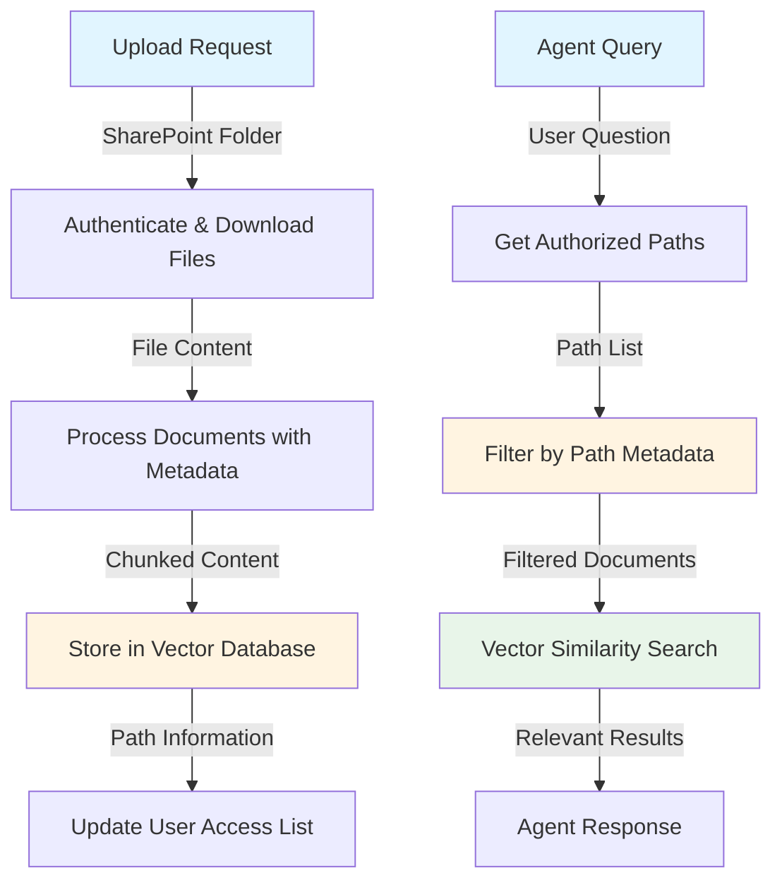

# Using SharePoint Within Agents

This guide explains how SharePoint integration works within the agent system, covering both uploading data from SharePoint and retrieving it for agent queries.

## Table of Contents

- [Uploading Data from SharePoint](#uploading-data-from-sharepoint)
- [Retrieving Data from SharePoint](#retrieving-data-from-sharepoint)
- [Complete Workflow](#complete-workflow)

---

## Uploading Data from SharePoint

The upload process begins by connecting to SharePoint using an API. Authentication is handled through an access token that is cached for efficient retrieval and reuse.

### Authentication Flow

1. **Access Token Retrieval**: The system retrieves the cached access token for authentication.

2. **File Download**: Using the API with the cached access token, the system downloads files from a specified SharePoint folder. Each file is processed individually.

3. **Document Creation**: Downloaded files are converted into structured documents. Each document contains:
   - **data**: The actual content of the file
   - **metadata**: File information, including the **path** which is crucial for later filtering

4. **Text Chunking**: The document content is processed using text splitting to break it into manageable chunks. This ensures that large documents can be efficiently stored and retrieved.

5. **Vector Storage**: The chunked documents are embedded and stored in a vector database with their associated metadata.

### Key Components

- **API Integration**: RESTful API for accessing SharePoint resources
- **Token Caching**: Efficient storage and retrieval of access tokens
- **Document Processing**: Standardized document format with content and metadata
- **Text Chunking**: Strategy for breaking down large documents into manageable pieces
- **Vector Storage**: Database for storing and searching document embeddings

---

## Retrieving Data from SharePoint

When an agent needs to retrieve information from SharePoint, it uses a specialized retriever tool that connects to the vector database.

### Retriever Tool Architecture

1. **Collection Connection**: The retriever tool connects to a specific collection in the vector database. This allows for data isolation and organization.

2. **Path-Based Filtering**: The retriever tool filters documents by path name, which is stored in the document metadata. This ensures that only relevant documents from the user's specific SharePoint folders are searched.

3. **User Data Association**: Each user has their own data configuration that contains a list of all SharePoint paths they have access to. The retriever uses this list to filter documents before performing searches.

4. **Filtered Search**: When a search is performed, it first applies path-based filtering, then searches only through the filtered subset of documents. This dramatically improves search efficiency and ensures users only see results from their authorized SharePoint locations.

### Retrieval Process

The retriever filters documents by path metadata before performing vector similarity search, ensuring users only access their authorized data.

### Key Features

- **Collection Isolation**: Each collection represents a specific data source or user context
- **Metadata Filtering**: Path information in metadata enables precise document filtering
- **User-Specific Access**: Users can only retrieve data from paths they have uploaded or have been granted access to
- **Efficient Search**: Pre-filtering reduces the search space, improving both speed and relevance

---

## Complete Workflow

The following flowchart illustrates the complete process from uploading SharePoint files to retrieving them through agent queries:

### Workflow Steps

**Upload Phase:**
1. User provides SharePoint folder path
2. System authenticates and downloads files from the folder
3. Files are processed into documents with metadata (including path information)
4. Documents are chunked and stored in a vector database
5. User's authorized path list is updated

**Retrieval Phase:**
1. Agent receives a user query
2. System retrieves the user's list of authorized SharePoint paths
3. Documents are filtered by matching paths in metadata against user's authorized paths
4. Filtered documents undergo vector similarity search
5. Relevant results are returned to the agent for processing

### Benefits of This Architecture

- **Security**: Path-based filtering ensures users only access their own data
- **Efficiency**: Pre-filtering reduces search space and improves query performance
- **Scalability**: Vector databases handle large document collections efficiently
- **Flexibility**: Users can connect multiple SharePoint folders to their agent
- **Isolation**: Collection-based storage allows for clean data separation

